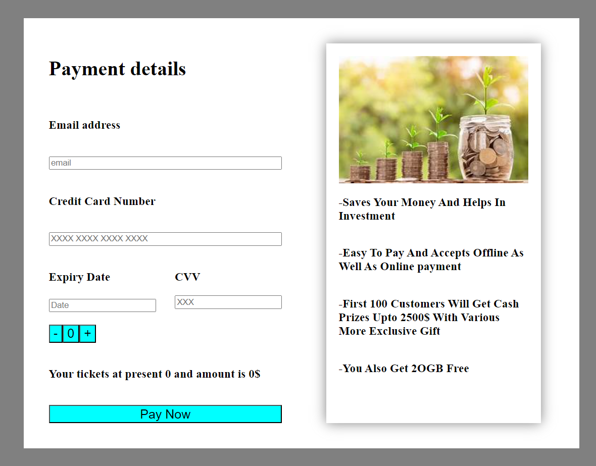

# My repo

## 
- Myself Divya Gandhi a Computer Engineering pursuing Student .
- I am currently working to become a frontend developer 
## My education status
- SSC percentage 95.2%
- HSC percentage 84.5%
- First year pass out with 9.525 CGPA
 
## My current skills 
- C(Programming language)
- Java(Programming language)
- HTML
- CSS
- Basic Javascript 

## My Motivation
- To be a very good software and bring some change in this world
- To develop as many skills as I can

### My project images 

